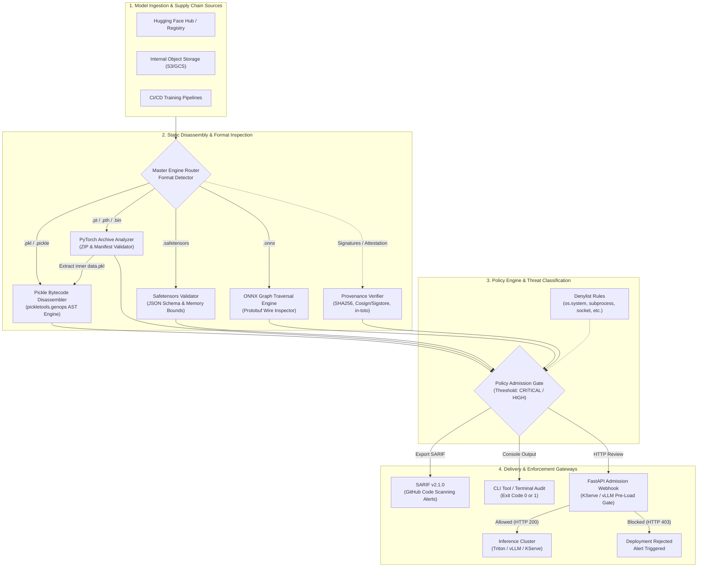

# MLSecOps: AI Model Supply Chain & Malicious Deserialization Scanner

[](https://github.com/ravishkarathnayaka/MLSecOps-AI-Model-Supply-Chain-Malicious-Deserialization-Scanne/actions/workflows/ci.yml)
[](https://github.com/ravishkarathnayaka/MLSecOps-AI-Model-Supply-Chain-Malicious-Deserialization-Scanne/actions/workflows/security-scan.yml)
[](LICENSE)
[](https://www.python.org/)
[](https://docs.oasis-open.org/sarif/sarif/v2.1.0/sarif-v2.1.0.html)

A production-grade, zero-cost MLSecOps security scanner and admission controller that statically inspects machine learning model artifacts (`.pkl`, `.pt`, `.pth`, `.bin`, `.onnx`, `.safetensors`) for arbitrary code execution payloads, malicious deserialization opcodes, unsafe ONNX computation graphs, and hidden data exfiltration hooks—**strictly without executing untrusted model weights or dynamic code**.

---

## 1. Executive Summary & Problem Space

Machine learning weight files distributed across open repositories like Hugging Face and model hubs often utilize Python's `pickle` serialization format (`.pkl`, `.pt`, `.bin`). Standard deserialization using `pickle.load()` or `torch.load()` immediately executes arbitrary code embedded via the Python `__reduce__` protocol, enabling supply chain attacks such as reverse shell spawning, credential theft, and persistent node compromise.

```
Untrusted Model Weight ---> torch.load() / pickle.load() ---> Immediate Host Shell & Data Exfiltration
```

This project eliminates runtime execution risks by implementing **safe static disassembly engines**:
- **Zero Runtime Execution:** Disassembles raw pickle bytecode using `pickletools.genops` and custom wire decoders without initializing runtime Python objects.
- **Modern Format Security:** Validates Safetensors memory layouts and header JSON schemas; traverses ONNX Protocol Buffer graphs to flag unauthorized operator domains and external path traversal references.
- **Cryptographic Provenance:** Verifies SHA-256 / SHA-512 hashes, detached digital signatures (RSA/ECDSA), and SLSA / in-toto build attestations.
- **Zero-Cost Deployment:** Operates completely offline or locally for $0 using lightweight Python libraries, Docker, and Kubernetes-compatible admission webhooks.

---

## 2. Architecture & Pipeline Workflow



---

## 3. Threat Taxonomy & Attack Vector Matrix

| Threat Category | File Formats | Attack Vector & Mechanism | Risk Level | Scanner Mitigation Rule |
| :--- | :--- | :--- | :--- | :--- |
| **Pickle Opcode Injection** | `.pkl`, `.pt`, `.bin` | Exploitation of `__reduce__` or `__reduce_ex__` to invoke `os.system`, `subprocess.Popen`, or `eval` during model loading. | **CRITICAL** | `ARBITRARY-CODE-EXECUTION-REDUCE`<br>`DANGEROUS-GLOBAL-CRITICAL` |
| **Network Exfiltration Hooks** | `.pkl`, `.pt` | Importing `socket.create_connection` or `urllib.request.urlopen` within deserialization routines to exfiltrate GPU data. | **CRITICAL** | `DANGEROUS-GLOBAL-CRITICAL`<br>`category: network_exfiltration` |
| **Zip Slip Traversal** | `.pt`, `.pth` | PyTorch ZIP archive containing file paths with directory traversal sequences (`../../etc/shadow`). | **CRITICAL** | `PYTORCH-ZIP-SLIP-TRAVERSAL` |
| **Embedded Executables** | `.pt`, `.bin` | Storing standalone binaries (`.sh`, `.exe`, `.so`) inside the model archive alongside weight tensors. | **HIGH** | `PYTORCH-EMBEDDED-EXECUTABLE` |
| **Safetensors Out-of-Bounds** | `.safetensors` | Tampered `data_offsets` in JSON header claiming buffer bounds beyond actual file length to cause buffer overflows. | **CRITICAL** | `SAFETENSORS-BUFFER-OUT-OF-BOUNDS` |
| **Tensor Size Inconsistency** | `.safetensors` | Declared shape/dtype element count mismatches physical offset length, indicating stealth payload smuggling. | **HIGH** | `SAFETENSORS-TENSOR-SIZE-MISMATCH` |
| **Adversarial ONNX Operators** | `.onnx` | Custom operator domains (`custom.adversarial`) or suspicious operators (`ExecutePayload`, `PyOp`, `PythonOp`). | **CRITICAL** | `ONNX-SUSPICIOUS-OPERATOR-TYPE`<br>`ONNX-UNTRUSTED-OPERATOR-DOMAIN` |
| **External Tensor Traversal** | `.onnx` | ONNX external data attributes targeting sensitive host paths using relative traversal sequences. | **CRITICAL** | `ONNX-EXTERNAL-DATA-TRAVERSAL` |
| **Digest Tampering** | All Formats | Man-in-the-middle tampering of model artifact weights resulting in SHA256/SHA512 checksum mismatch. | **CRITICAL** | `PROVENANCE-SHA256-MISMATCH` |
| **Cryptographic Forgery** | All Formats | Invalid Cosign/Sigstore detached signatures or mismatched SLSA/in-toto attestation subject digests. | **CRITICAL** | `SIG-VERIFICATION-FAILED`<br>`ATTESTATION-DIGEST-MISMATCH` |

---

## 4. Directory Layout

```
├── .github/
│   └── workflows/
│       ├── ci.yml                 # Code linting, type checks, and pytest test suite
│       └── security-scan.yml      # Trivy and Gitleaks security scans
├── docker/
│   ├── docker-compose.yml         # Local stack: Scanner API, Redis cache, and Mock Inference Server
│   └── .env.example               # Environment variables template
├── scanner/
│   ├── __init__.py
│   ├── core/
│   │   ├── __init__.py
│   │   ├── engine.py              # Master orchestration engine routing files to format-specific analyzers
│   │   └── reporter.py            # Generates structured SARIF v2.1.0, JSON, and CLI terminal audit reports
│   ├── analyzers/
│   │   ├── __init__.py
│   │   ├── pickle_inspector.py    # Disassembles pickle bytecode (pickletools.genops) flagging unsafe globals/reduces
│   │   ├── pytorch_analyzer.py    # Inspects PyTorch ZIP archives, manifests, zip slips, and inner pickle weights
│   │   ├── onnx_analyzer.py       # Traverses ONNX graphs detecting custom domains and suspicious op types
│   │   └── safetensors_checker.py # Validates Safetensors header JSON schema and verifies zero-executable guarantees
│   ├── rules/
│   │   ├── __init__.py
│   │   ├── dangerous_symbols.py   # Comprehensive denylist of dangerous execution symbols and module hierarchies
│   │   └── policy_engine.py       # Evaluates findings against configurable severity thresholds (FAIL on Critical/High)
│   └── provenance/
│       ├── __init__.py
│       ├── hash_verifier.py       # Computes SHA256 / SHA512 and compares with Model Card metadata
│       └── signature_checker.py   # Validates detached signatures and in-toto / SLSA attestations
├── admission_gate/
│   ├── __init__.py
│   ├── webhook_server.py          # FastAPI admission controller intercepting model loading requests
│   └── Dockerfile                 # Hardened non-root production container definition
├── cli/
│   ├── __init__.py
│   └── main.py                    # Production CLI tool: 'mlsec-scan --path ./models/ --fail-on high'
├── test_models/
│   ├── generate_test_models.py    # Script generating benign models (.safetensors, .onnx) and harmless synthetic probes
│   └── README.md                  # Documentation on synthetic test samples
├── tests/
│   ├── __init__.py
│   ├── test_pickle_inspector.py   # Unit tests validating detection of injected pickle opcodes
│   ├── test_safetensors.py        # Unit tests verifying clean parsing of compliant safetensors files
│   ├── test_onnx_analyzer.py      # Unit tests ensuring standard ONNX graphs pass while abnormal nodes are flagged
│   ├── test_provenance.py         # Unit tests validating SHA256 hashes, digital signatures, and in-toto attestations
│   └── test_cli_sarif.py          # Tests validating standard SARIF output format for GitHub Code Scanning
├── pyproject.toml                 # Package configuration, CLI entrypoint, and test settings
├── requirements.txt               # Lightweight open-source production dependencies
└── README.md                      # Comprehensive architecture, threat taxonomy, and usage guide
```

---

## 5. Quickstart & Installation

### Step 1: Install Dependencies
```bash
pip install -r requirements.txt
# Or install in editable mode with CLI entrypoint:
pip install -e .
```

### Step 2: Generate Harmless Synthetic Test Models
Generate reference safe models and benign test payloads (`builtins.print` callbacks):
```bash
python test_models/generate_test_models.py
```

### Step 3: Run the Automated Test Suite
Execute the zero-dependency test suite (30+ test cases):
```bash
python -m pytest tests/ -v
```

---

## 6. Command-Line Interface (CLI) Usage

The scanner provides a CLI (`mlsec-scan` or `python -m cli.main`) suitable for CI/CD gates and automated pre-deployment scanning.

### Scan Single Artifacts or Entire Directories
```bash
# Scan a single compliant Safetensors model (terminal text report)
python -m cli.main --path test_models/safe_model.safetensors --format text

# Scan an entire directory of model files
python -m cli.main --path test_models/ --format text --fail-on high
```

### Output Formats

#### 1. GitHub Code Scanning SARIF v2.1.0 Export
Export results directly into GitHub SARIF format for ingestion into the GitHub Security tab:
```bash
python -m cli.main --path test_models/ --format sarif --output sarif-results.sarif
```

#### 2. Machine-Readable JSON Export
```bash
python -m cli.main --path test_models/ --format json --output audit-report.json
```

### Enforcing Strict Verification Mode
Flag any global reference that is not on the recognized safe tensor allowlist:
```bash
python -m cli.main --path test_models/safe_model.pkl --strict
```

### Verifying Cryptographic Provenance
```bash
# Verify against expected SHA-256 digest from a model card:
python -m cli.main --path models/resnet50.safetensors \
  --verify-sha256 e3b0c44298fc1c149afbf4c8996fb92427ae41e4649b934ca495991b7852b855

# Verify detached cryptographic signature:
python -m cli.main --path models/model.bin \
  --signature models/model.sig \
  --public-key keys/release_pubkey.pem

# Verify in-toto / SLSA provenance attestation:
python -m cli.main --path models/model.bin \
  --attestation models/provenance.json
```

---

## 7. Sample Terminal Audit Output

When a malicious or tampered model artifact is scanned, the scanner prints an audit log and exits with code `1`:

```
==================================================================================
   MLSecOps: AI Model Supply Chain & Malicious Deserialization Scanner v1.0.0
==================================================================================
Target(s) Scanned : 8 model artifact(s)
Fail Threshold    : HIGH
Risk Score        : 100.0/100.0

SECURITY FINDINGS (8 detected):
----------------------------------------------------------------------------------
1. [HIGH] Unrecognized ONNX Opset Domain: 'custom.adversarial'
   Rule ID  : ONNX-UNRECOGNIZED-OPSET-DOMAIN
   Category : untrusted_domain
   Location : test_models/custom_op.onnx::opset_import
   Detail   : Model imports opset with non-standard domain 'custom.adversarial' (version 1). Untrusted custom domains may load unvetted operator binaries.
   Context  : domain=custom.adversarial, version=1

2. [HIGH] Untrusted Operator Domain 'custom.adversarial' in Node 'suspicious_node'
   Rule ID  : ONNX-UNTRUSTED-OPERATOR-DOMAIN
   Category : untrusted_operator
   Location : test_models/custom_op.onnx::node[suspicious_node]
   Detail   : Node 'suspicious_node' of type 'ExecutePayload' belongs to untrusted domain 'custom.adversarial'. Rejecting custom or non-standard operator domains.
   Context  : node=suspicious_node, op_type=ExecutePayload, domain=custom.adversarial

3. [CRITICAL] Potentially Malicious Operator Type 'ExecutePayload'
   Rule ID  : ONNX-SUSPICIOUS-OPERATOR-TYPE
   Category : arbitrary_execution
   Location : test_models/custom_op.onnx::node[suspicious_node]
   Detail   : Node 'suspicious_node' invokes suspicious operator type 'ExecutePayload' frequently associated with code execution or custom dynamic hooks.
   Context  : node=suspicious_node, op_type=ExecutePayload

4. [CRITICAL] Tensor Buffer Offset Out of Bounds for 'weight_oob'
   Rule ID  : SAFETENSORS-BUFFER-OUT-OF-BOUNDS
   Category : memory_bounds_violation
   Location : test_models/malformed.safetensors::tensor[weight_oob]
   Detail   : Tensor 'weight_oob' offsets [0, 999999] exceed buffer boundaries (total buffer size: 16 bytes).
   Context  : start=0, end=999999, buffer_size=16

5. [HIGH] Dangerous Global Reference: builtins.print
   Rule ID  : DANGEROUS-GLOBAL-HIGH
   Category : synthetic_probe
   Location : test_models/trojan_print.pkl [Bytecode Offset: 0x001E]
   Detail   : Standard print function. Safe payload callback used in synthetic benign tests.
   Context  : module=builtins, symbol=print, offset=30, hex_offset=0x1e, opcode=GLOBAL

6. [CRITICAL] Malicious REDUCE Opcode Injected: builtins.print
   Rule ID  : ARBITRARY-CODE-EXECUTION-REDUCE
   Category : code_execution
   Location : test_models/trojan_print.pkl [Bytecode Offset: 0x005D]
   Detail   : REDUCE opcode executes callable 'builtins.print' during deserialization. Argument payload signature: [StackItem(string, 'Safe Test Payload - Deserialization Inspection Triggered')]. This facilitates immediate arbitrary code execution upon model loading.
   Context  : callable_module=builtins, callable_name=print, offset=93, hex_offset=0x5d, opcode=REDUCE, rule_category=synthetic_probe

7. [HIGH] Dangerous Global Reference: builtins.print
   Rule ID  : DANGEROUS-GLOBAL-HIGH
   Category : synthetic_probe
   Location : test_models/trojan_print.pt::archive/data.pkl [Bytecode Offset: 0x001E]
   Detail   : Standard print function. Safe payload callback used in synthetic benign tests.
   Context  : module=builtins, symbol=print, offset=30, hex_offset=0x1e, opcode=GLOBAL

8. [CRITICAL] Malicious REDUCE Opcode Injected: builtins.print
   Rule ID  : ARBITRARY-CODE-EXECUTION-REDUCE
   Category : code_execution
   Location : test_models/trojan_print.pt::archive/data.pkl [Bytecode Offset: 0x005D]
   Detail   : REDUCE opcode executes callable 'builtins.print' during deserialization. Argument payload signature: [StackItem(string, 'Safe Test Payload - Deserialization Inspection Triggered')]. This facilitates immediate arbitrary code execution upon model loading.
   Context  : callable_module=builtins, callable_name=print, offset=93, hex_offset=0x5d, opcode=REDUCE, rule_category=synthetic_probe

----------------------------------------------------------------------------------
ADMISSION GATE VERDICT:
   [ REJECTED / BLOCKED ] DEPLOYMENT FORBIDDEN - Critical/High security violations!
   Policy evaluation FAILED: 8 violation(s) exceeded the threshold 'HIGH'. Blocked model deployment.
==================================================================================
```

---

## 8. Admission Controller Webhook (Inference Server Gatekeeper)

The admission gatekeeper provides a high-throughput FastAPI service to gate model loading requests on KServe, vLLM, or Triton inference clusters.

### Starting the Webhook Server
```bash
uvicorn admission_gate.webhook_server:app --host 0.0.0.0 --port 8000
```

### Endpoints

| Endpoint | Method | Purpose |
| :--- | :--- | :--- |
| `/healthz` | `GET` | Liveness and readiness probe for Kubernetes. |
| `/metrics` | `GET` | Scan metrics (total scans, pass rate, blocked models). |
| `/v1/admission/review` | `POST` | Reviews mounted model URI prior to inference loading. |
| `/v1/scan/upload` | `POST` | Direct artifact upload for ad-hoc static inspection. |

### Admission Review Request Payload
```json
{
  "model_uri": "test_models/safe_model.safetensors",
  "fail_on": "high",
  "include_sarif": false
}
```

### Admission Review Response (Approved)
```json
{
  "allowed": true,
  "verdict": "PASSED",
  "fail_threshold": "HIGH",
  "violations_count": 0,
  "findings_count": 0,
  "risk_score": 0.0,
  "summary": "Policy evaluation PASSED: No security findings detected.",
  "model_uri": "test_models/safe_model.safetensors",
  "scanned_files": ["test_models/safe_model.safetensors"],
  "findings": []
}
```

---

## 9. Docker & Local Stack Deployment

A complete local stack containing the Scanner API, Redis metrics cache, and a Mock Inference Server is provided under `docker/`.

```bash
cd docker/
cp .env.example .env
docker compose up -d --build
```

Test the admission gate through the mock inference server:
```bash
# Request to load safe model -> 200 OK
curl -X POST http://localhost:8080/v1/models/load \
  -H "Content-Type: application/json" \
  -d '{"model_path": "/models/safe_model.safetensors"}'

# Request to load trojan model -> 403 Forbidden (Blocked)
curl -X POST http://localhost:8080/v1/models/load \
  -H "Content-Type: application/json" \
  -d '{"model_path": "/models/trojan_print.pkl"}'
```

---

## 10. Synthetic Non-Destructive Benchmark Suite

All test artifacts generated by `test_models/generate_test_models.py` adhere to the **Zero-Destruction Guarantee**:

1. **Non-Destructive Callbacks:** Synthetic probes use standard `builtins.print("Safe Test Payload")` inside `__reduce__` to verify opcode detection. No shell execution, system modifications, or file destructions are performed.
2. **Safe Boundary Benchmarks:** Out-of-bounds offsets are tested against synthetic buffers to verify memory boundary checks without triggering real operating system faults.
3. **Reproducibility:** Test models are generated deterministically in milliseconds without requiring PyTorch or GPU hardware.

---

## 11. License

This project is licensed under the [MIT License](LICENSE).
